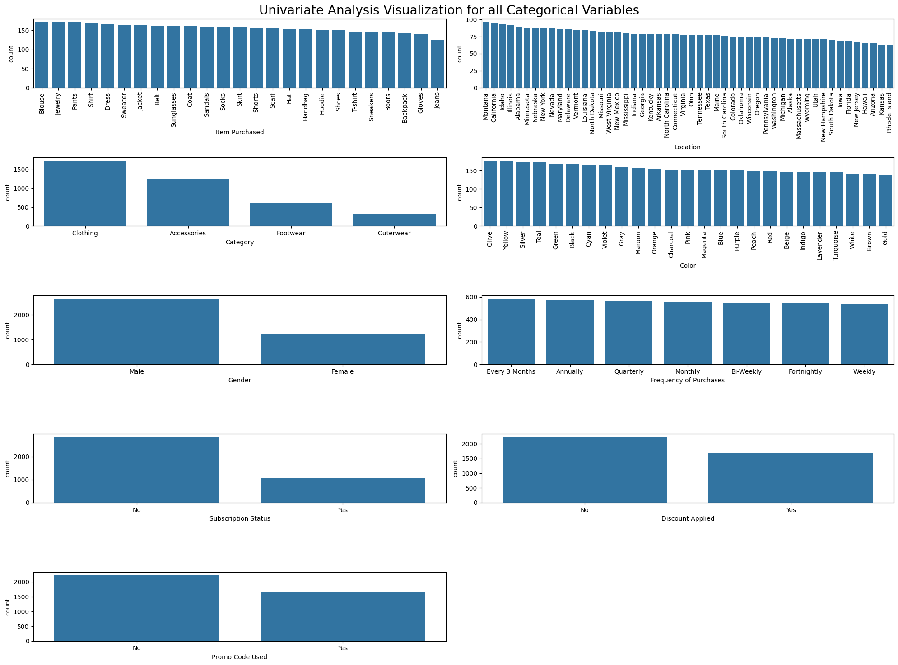
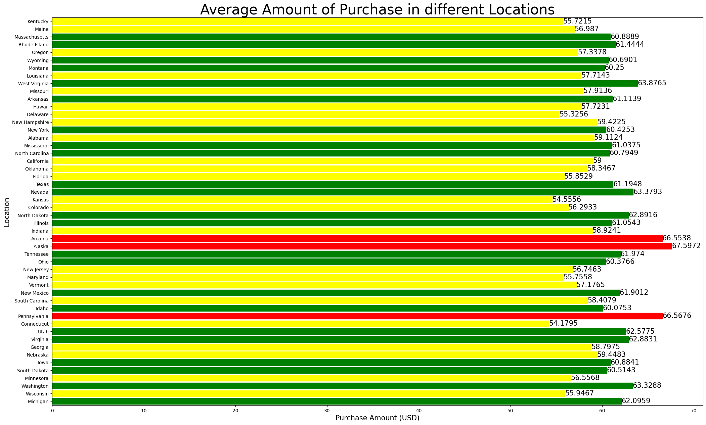
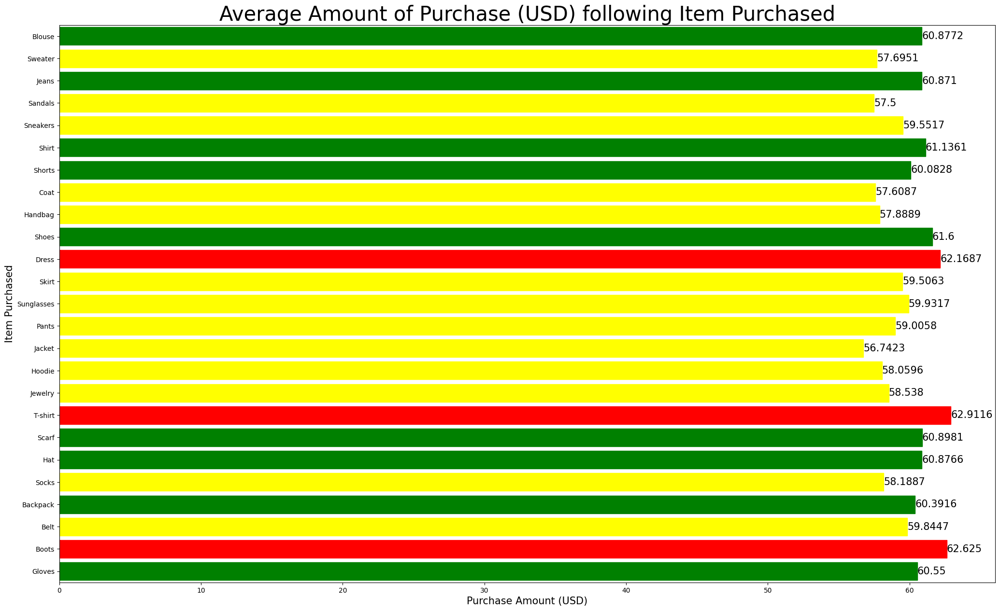
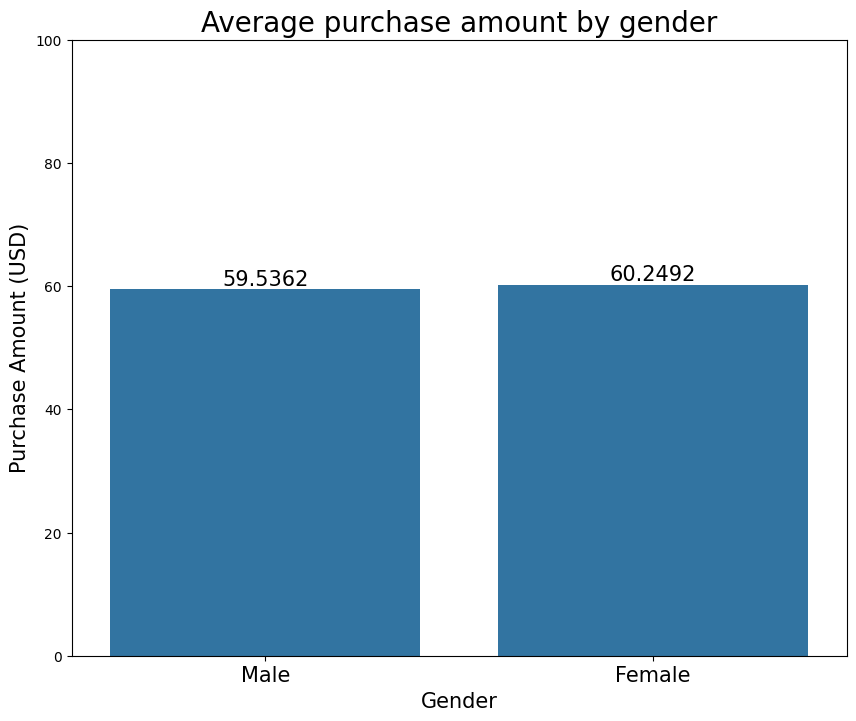
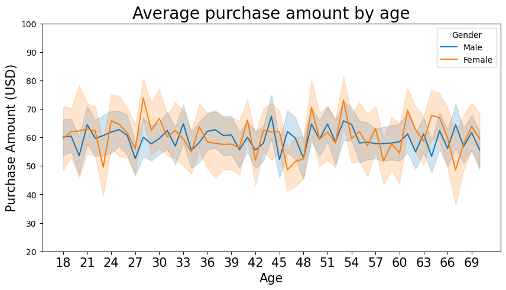
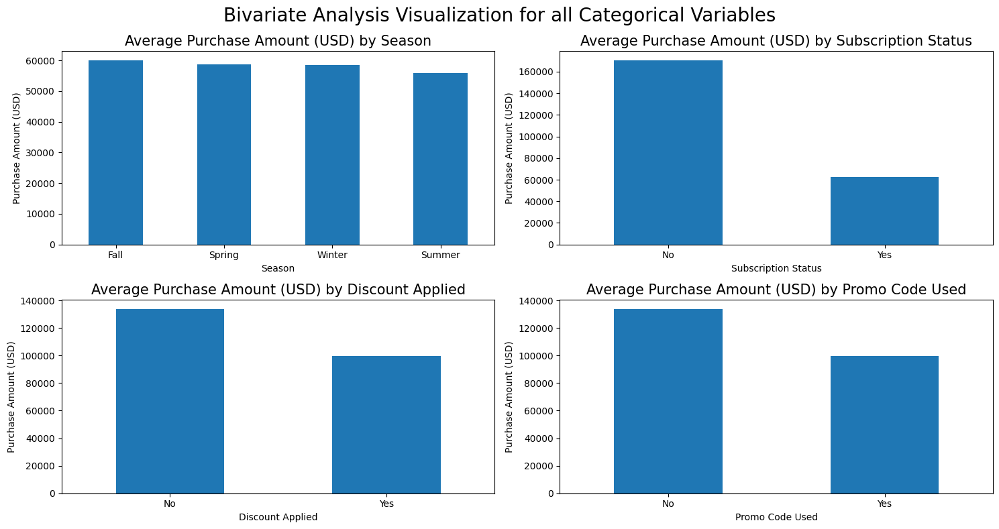

# Abstract
* The Consumer Behaviour and Shopping Habits The dataset provides comprehensive insights into consumers' preferences, tendencies, and patterns during their shopping experiences.
* This dataset captures a diversity of customer attributes including age, gender, purchase history, preferred payment methods, frequency of purchases, and more.
* The dataset is valuable for businesses aiming to align their strategies with customer needs and preferences.
* Understanding customer preferences and trends is critical for businesses to tailor the Analysects, marketing strategies, and overall customer experience. Analyzing this data can help business makes informed decisions, optimise product offerings, and enhance customer satisfaction.
* Additionally, data on the type of items purchased, shopping frequency, preferred shopping seasons, and interactions with promotional offers is included. With a collection of 3900 recored, this dataset serves as a foundation for business looking to apply data-driven insights for better decision-making and customer-centeric strategies.

# Frameworks
* Pandas and NumPy to manipulate the data.
* Seaborn and Matplotlib to visualize the data.

# Graphs
### Univariate Analysis Visualization for all Categorical Variables

### Average Amount of Purchases (USD) in different locations

### Average Amount of Purcase (USD) following Item Purchased

### Average Amount of Purchase by Gender and Age

### Biveriate Analysis Visualization for all Categorical Variables
